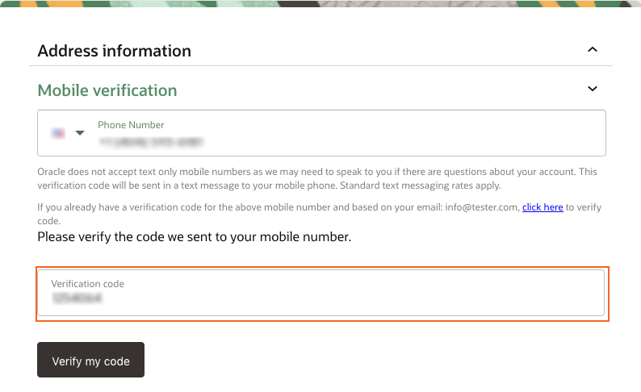

# Get started - register Free Tier account

## Introduction

Before you get started, you will need an Oracle Cloud account. This lab walks you through the steps of getting an Oracle Cloud Free Tier account and signing in.

Estimated Time: 5 minutes

### Existing Cloud Accounts

If you already have access to an Oracle Cloud account, including an Oracle Cloud account using [Oracle Universal Credits](https://docs.oracle.com/en/cloud/get-started/subscriptions-cloud/csgsg/universal-credits.html), skip to **Task 2** to sign in to your cloud tenancy.

### Objectives

-   Create an Oracle Cloud Free Tier account
-   Sign in to your account

### Prerequisites

-   A valid email address
-   Ability to receive SMS text verification (only if your email isn't recognized)

**Note**: Interfaces in the following screenshots may look different from the interfaces you will see.

Collapse All Tasks

## Task 1: Create Your Free Trial Account

If you already have a cloud account, skip to **Task 2**.

1.  Open up a web browser to access the Oracle Cloud account registration form at [oracle.com/cloud/free](https://signup.cloud.oracle.com/).

    You will be presented with a registration page.

2.  Enter the following information to create your Oracle Cloud Free Tier account.
    -   Choose your **Country**
    -   Enter your **Name** and **Email**
3.  Once you have entered a valid email address, select the **Verify my email** button. The screen will appear as follows after you select the button:
4.  Go to your email. You will see an account validation email from Oracle in your inbox. The email will be similar to the following:
5.  Select the link (if possible) or copy and paste the link into your browser.
6.  Enter the following information to create your Oracle Cloud Free Tier account.
    -   Choose a **Password**
    -   Enter your **Company Name**
    -   Your **Cloud Account Name** will generate automatically based on your inputs. You can change that name by entering a new value. Remember what you wrote. You'll need this name later to sign in.
    -   Choose a **Home Region**. Your Home Region cannot be changed once you sign-up. Note: Based on the current design of the workshop and resource availability, it is recommended not to use the London region for this workshop at this time.
    -   Click **Continue**
7.  Enter your Address information. Click **Continue**.
8.  Choose your country and enter a mobile number for verification. Click the **Text me a code** button.
9.  Once you receive your code, enter it and click **Verify My Code**.
10. Click the **Add payment verification method** button.
11. Choose the verification method. In this case, click the **Credit Card** button. Enter your information and payment details.

    **Note:** This is a free credit promotion account. You will not be charged unless you elect to upgrade the account.

    

12. Once your payment verification is complete, review and accept the agreement by clicking the check box. Click the **Start my free trial** button.

    

13. Your account is provisioning and should be available soon! You might want to log out as you wait for your account to be provisioned. You'll receive two emails from Oracle. One email will be the initial notification that provisioning is underway. The other email will be a notification that provisioning is complete. Here is a copy of the final notification:

## Task 2: Sign in to Your Account

*Please note that while your tenancy is initially created, you will only see a direct login. Once your tenancy is fully provisioned, you will see the screens as described below.*

1.  Go to [cloud.oracle.com](https://cloud.oracle.com/). Enter your Cloud Account Name and click **Next**. This is the name you chose while creating your account in the previous section. It's NOT your email address. If you've forgotten the name, see the confirmation email.

    

2.  Click **Continue** to sign in using the *"oraclecloudidentityservice"*.

    

    When you sign up for an Oracle Cloud account, a user is created for you in Oracle Identity Cloud Service with the username and password you selected at sign up. You can use this single sign-on option to sign in to Oracle Cloud Infrastructure and then navigate to other Oracle Cloud services without re-authenticating. This user has administrator privileges for all the Oracle Cloud services included with your account.

3.  Enter your Cloud Account credentials and click **Sign In**. Your user name is your email address. The password is what you chose when you signed up for an account.

    

4.  You are now signed in to Oracle Cloud!

    

You may now **proceed to the next lab**
