# Preparing Your Tenancy for Oracle E-Business Suite

## Introduction

In this exercise, you will prepare your Oracle E-Business Suite environment by setting up EBS Cloud Manager authentication with Identity Cloud Service (IDCS).

Estimated Lab Time: 30 minutes

Watch this short video to preview how to prepare your tenancy for Oracle E-Business Suite.

### **Objectives**

-   Setup EBS Cloud Manager Authentication with Identity Cloud Service (IDCS)
-   Create the EBS Cloud Manager Administrators group and user in IDCS
-   Register Oracle E-Business Suite Cloud Manager as a Confidential Application in IDCS

### **Prerequisites**

-   Tenancy Admin User
-   Tenancy Admin Password

Collapse All Tasks

## Task 1: Create the EBS Cloud Manager Administrators group and user in IDCS

1.  As the Tenancy Administrator, log in to the Oracle Cloud Infrastructure console.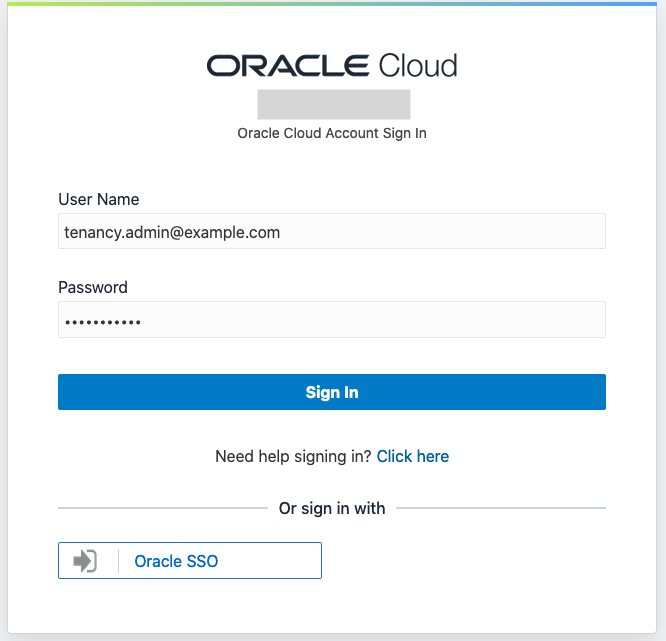
2.  In the Oracle Cloud Infrastructure console menu, under Governance and Administration, navigate to **Identify & Security \> Federation**.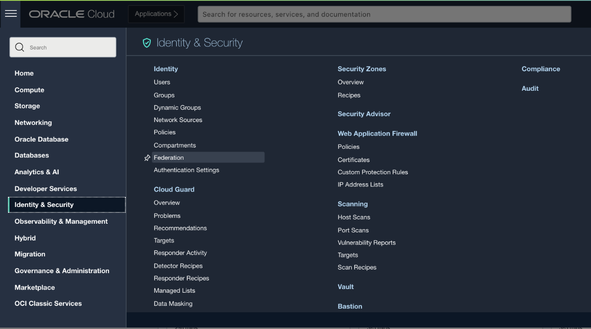
3.  Click on OracleIdentityCloudService
4.  Click on the link next to **Oracle Identity Cloud Service Console**.

    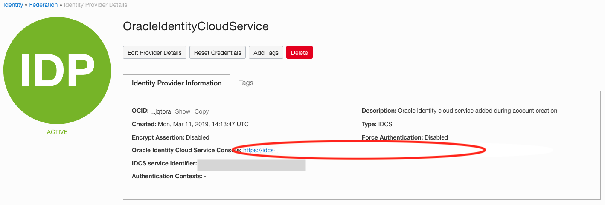

5.  Login to IDCS with the Tenancy Admin User.
6.  From the IDCS console, create your Oracle E-Business Suite Cloud Manager group:

    a. Click the navigation menu and select **Groups**.

    b. Click the **Add** button.

    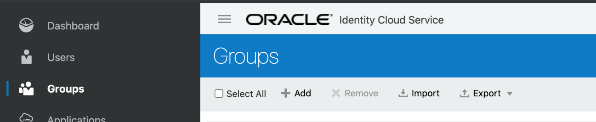

    c. In the Add Group dialog box (Step 1: Group Details), supply the following information:

    1.  **Name**: Enter the name idcs-ebscm-grp
    2.  **Description**: Enter a description of your choice.

        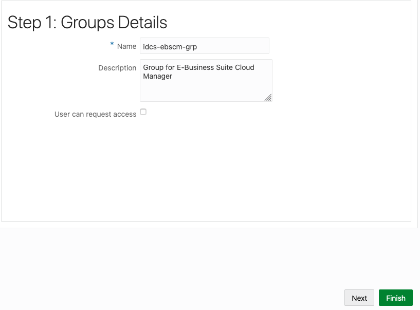

        d. Click **Finish**.

7.  While still in the IDCS console, create your Oracle E-Business Suite Cloud Manager Administrator user:

    a. Click the navigation menu and select **Users**.

    b. Click **Add**.

    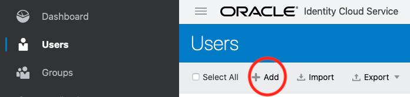

    c. In the Add User dialog box (Step 1: Add User Details), supply the following information:

    1.  **First Name**: EBS Cloud Manager
    2.  **Last Name**: Administrator
    3.  **User Name**: ebscm.admin@example.com
    4.  **Use the email address as the user name**: Deselect the check box
    5.  **Email**: Use the same email addressed you used when registering.

        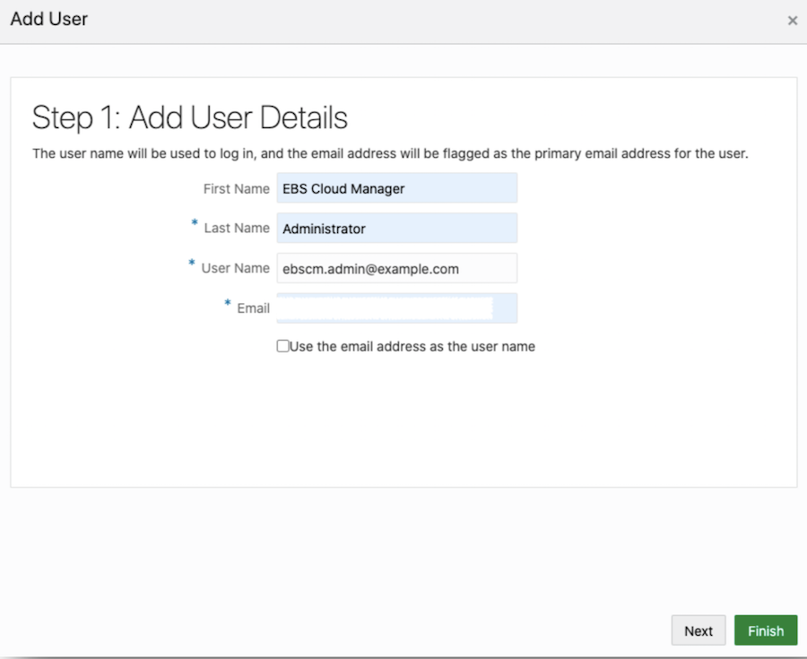

        d. Click **Next**.

        e. On the Step 2: Assign User to Groups dialog window, select the check box for the group you just created (idcs-ebscm-grp).

        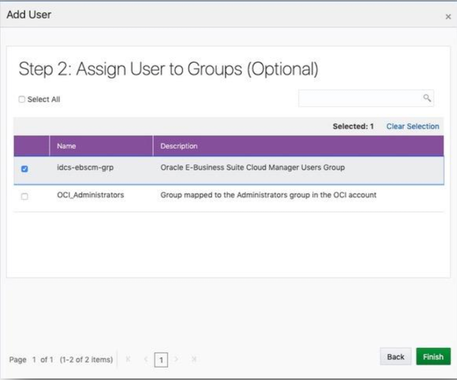

        f. Click **Finish**.

8.  From the IDCS console navigation menu, click **Security** to expand the menu. Then click **Administrators**.
9.  On the Administrators page:

    a. Expand the **Application Administrators** section.

    b. Click **Add**.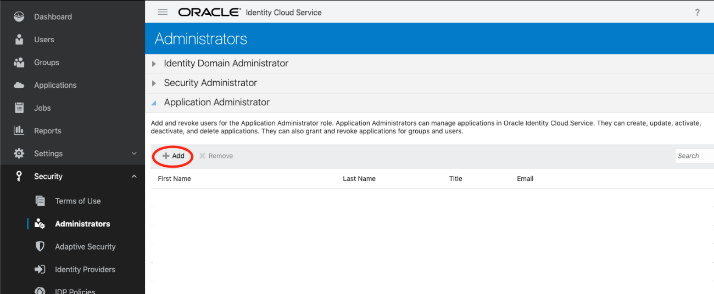

10. In the Add Users to the Administrator Role dialog box, select the check box for the EBS Cloud Manager Administrator (ebscm.admin@example.com).

    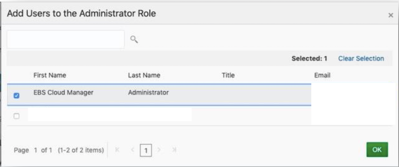

11. Click **OK**.

    Note: The Cloud Manager administrator will register the app as a confidential application in the next section.

12. Log out of the IDCS console by clicking on your user avatar icon at the top right of your screen. Then, click **Sign Out**.

    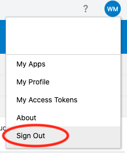

## Task 2: Register Oracle E-Business Suite Cloud Manager as a Confidential Application in IDCS

Note: The ebscm.admin@example.com performs the tasks in this section.

In this section, you will register the Oracle E-Business Suite Cloud Manager as a Confidential Application.

1.  Open the Welcome email that was received in the previous section.
2.  Click the yellow **Activate Your Account** button in the email.

    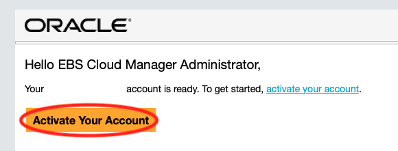

3.  Enter a new password, confirm, and click Submit. Document this password in your key-data.txt, field Cloud_Manager_Admin_Password.
4.  Click **OK** to continue, which will take you to the IDCS Login screen. Otherwise, log into IDCS using the steps outlined previously (OCI Console \> Identity \> Federation).
5.  Enter the EBS Cloud Manager user name (ebscm.admin@example.com) and password you just entered in the previous screen to log in.
6.  Click on your user avatar menu in the top right corner. This will display a drop-down menu.

    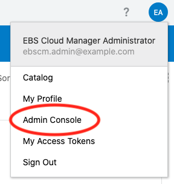

7.  Select **Admin Console**. This will display the IDCS Administration Console.

    If there is no **Admin Console** option to select, you may already be on the Admin Console. Below is an example of the Admin Console after you login.

    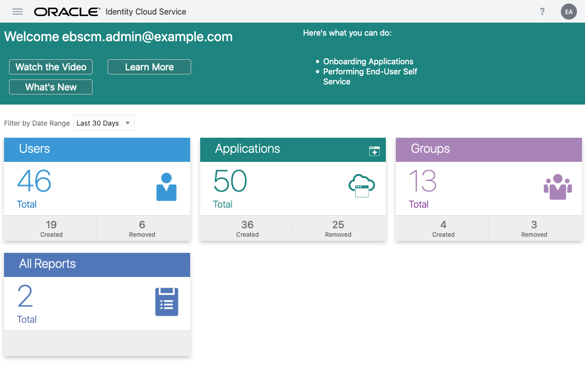

8.  In the top right of the Applications tile, click the icon to Add an Application.

    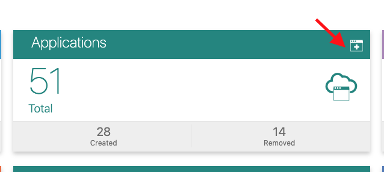

9.  Select **Confidential Application**. This takes you to the Add Confidential Application page.

    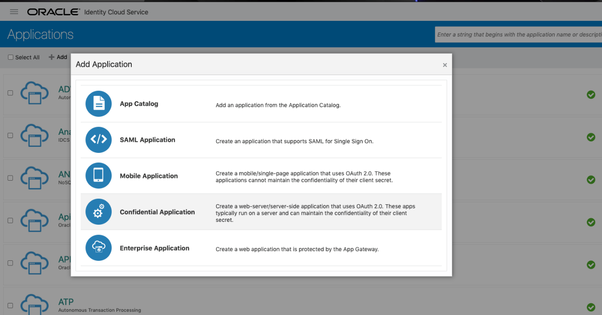

10. On the Details screen, enter the following:

    a. **Name**: Oracle E-Business Suite Cloud Manager

    b. **Description**: Write a description.

    c. Click **Next**.

    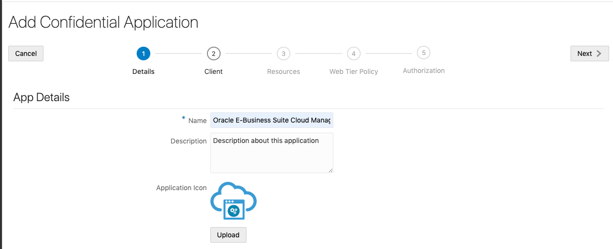

11. On the Client screen:

    a. Select **Configure this application as a client now**.

    b. Under **Allowed Grant Types**, select the following check boxes:

    1.  Client Credentials
    2.  Refresh Token
    3.  Authorization Code

        c. Here we are going to set our cloud manager url. For this lab we will use the following example URL.

        Example Cloud Manager URL: https://myebscm.ebshol.org:443

        Save your cloud manager url in your key-data.txt file as Cloud_Manager_URL

        Using the Cloud Manager url you have just saved, append that url with the following values as shown below to enter your Redirect URL.

        d. **Redirect URL**: \<Cloud_Manager_URL\>/cm/auth/callback

        Example: https://myebscm.ebshol.org:443/cm/auth/callback

        e. **Logout URL**: Leave this field empty.

        f. **Post-Logout Redirect URL**: \<Cloud_Manager_URL\>/cm/ui/index.html?root=login

        Example: https://myebscm.ebshol.org:443/cm/ui/index.html?root=login

        g. Select the **Introspect** option for **Allowed Operations**.

        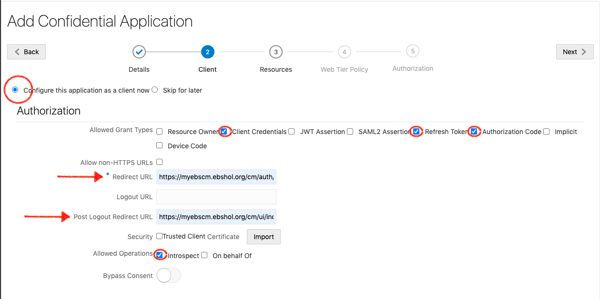

        h. Under **Grant the client access to Identity Cloud Service Admin APIs**:

    4.  Click Add.

        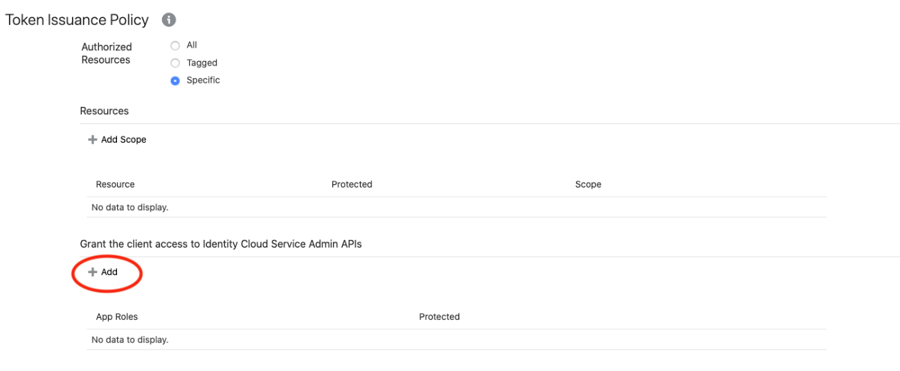

    5.  Select **Authenticator Client** and **Me** in the pop-up window.
    6.  Click Add again.

        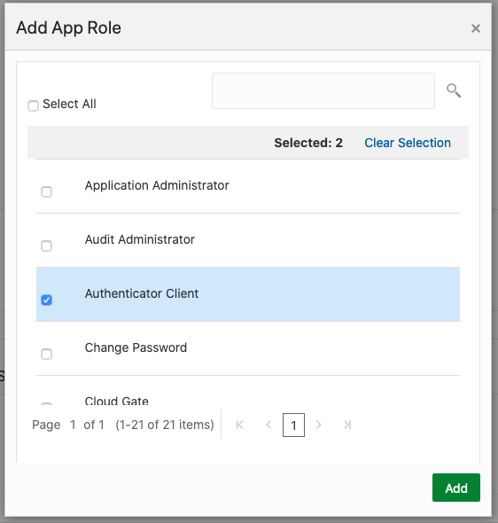

        i. Click **Next** at the top of the screen.

12. On the Resources screen, click **Next**.

    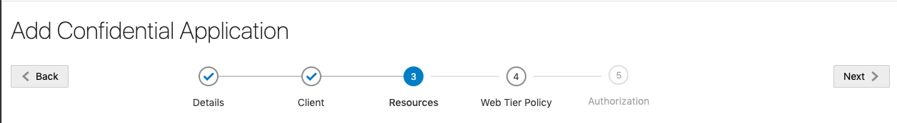

13. On the Web Tier screen, click **Next**.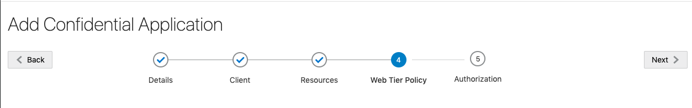
14. On the Authorization screen, click **Finish**.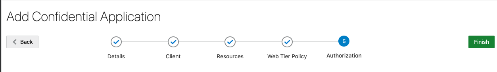
15. Make note of the following values in your key-data.txt file (under Client_ID and Client_Secret, respectively) when they are displayed in a pop-up window:

    a. **Client ID**

    b. **Client Secret**

    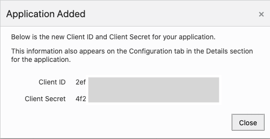

    If you need to view these values again, select the **Configuration** tab in the app's page. The values are listed under **General Information**.

    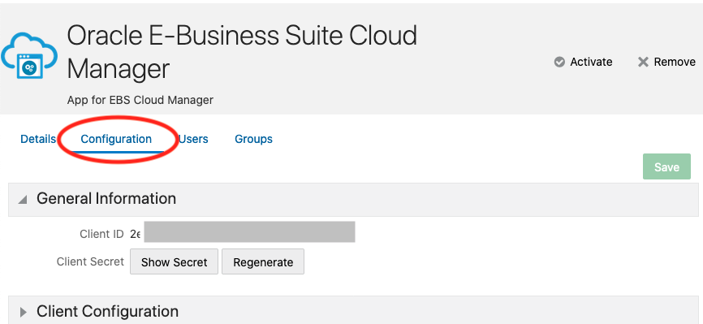

16. Click **Close**.
17. Click **Activate** to activate the Confidential Application.

    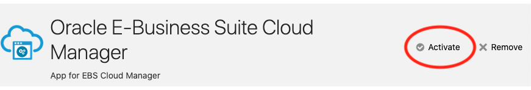

18. Click on the avatar icon on the top right hand side of the screen.
19. Select the **About** option.

    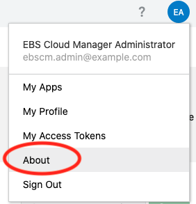

20. Copy the value displayed for Instance GUID. Record this as Client_Tenant in the key-data.txt. Your IDCS Client Tenant begins with the characters idcs- and then is followed by a string of numbers and letters, for example, idcs-6572bfeb183b4becad9e649bfa14a488.

    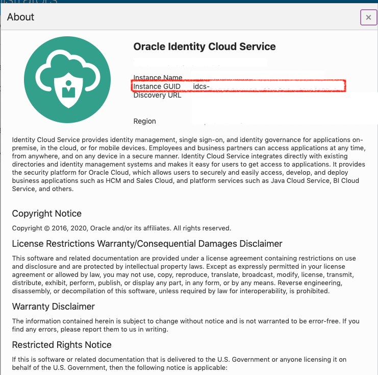

You may now proceed to the next lab.

## Acknowledgements

-   **Author:** Quintin Hill, Cloud Engineering
-   **Contributors:**
-   Santiago Bastidas, Product Management Director
-   William Masdon, Cloud Engineering
-   Mitsu Mehta, Cloud Engineering
-   Chris Wegenek, Cloud Engineering
-   **Last Updated By/Date:** Chris Wegenek, Cloud Engineering, September 2021
