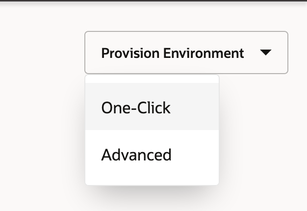
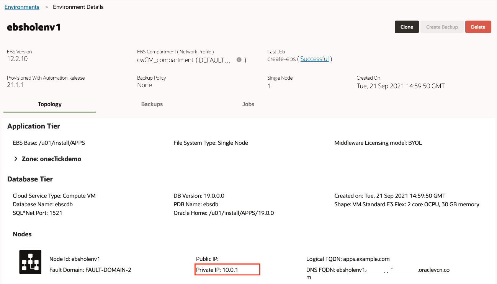
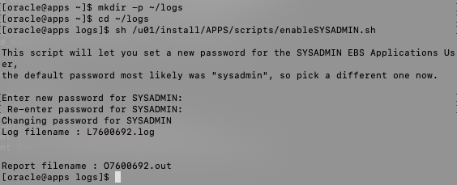
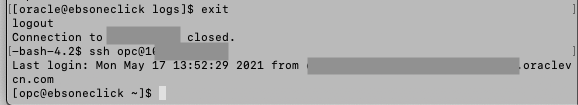
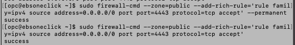
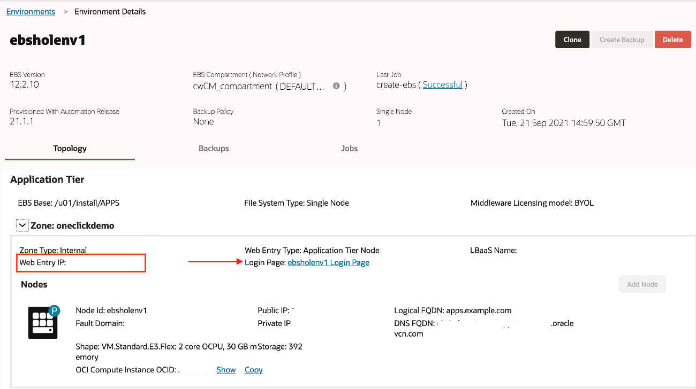

# Oracle E-Business Suite Cloud Manager Deployment and Configuration

## Introduction

In this lab, we will deploy the Oracle E-Business Suite Cloud Manager using the Marketplace Application: Oracle E-Business Suite Cloud Manager Stack for Demos.

Estimated Lab Time: 30 minutes

Watch this short video to preview how to deploy your Oracle E-Business Suite cloud manager.

### **Objectives**

-   Deploy and Configure Oracle E-Business Suite Cloud Manager
-   Verifying login into Oracle E-Business Suite Cloud Manager

### **Prerequisites**

-   Tenancy Admin User
-   Tenancy Admin Password
-   Lab 1 for preparing your tenancy completed with your IDCS information documented in your key-data.txt file.
    -   Cloud_Manager_Admin_Username
    -   Cloud_Manager_Admin_Password
    -   Client_Tenant
    -   Client_ID
    -   Client_Secret

Collapse All Tasks

## Task 1: Sign in to the Oracle Cloud Infrastructure Console

Use the tenancy administrator credentials to sign in to Oracle Cloud Infrastructure console.

1.  Reference your key-data.txt file and locate the tenancy administrator credentials.
2.  Sign in to the Oracle Cloud Infrastructure console using the following:
    -   **User name**: Tenancy Admin User
    -   **Password**: Tenancy Admin Password

## Task 2: Deploy and Configure Oracle E-Business Suite Cloud Manager

You will now deploy an E-Business Suite Cloud Manager using a Marketplace stack. The stack creates the following cloud resources:

-   A compartment to contain resources required by Oracle E-Business Suite Cloud Manager.
-   An EBS Cloud Manager Administrators IAM user and group, as well as the policies required to manage the compartment.
-   Network resources – including a VCN, an internet gateway, subnets, route tables, security lists, and security rules.
-   A Compute instance for running the Oracle E-Business Suite Cloud Manager.

Then, the stack will configure Oracle E-Business Suite Cloud Manager to work with your OCI tenancy and the newly created OCI resources.

1.  In the Oracle Cloud Infrastructure console navigation menu, under **Marketplace** select **All Applications**.

    

2.  From the Marketplace applications page:

    a. Select **Stack** under Filter \> Type

    b. In the search bar type "E-Business Suite"

    c. Click the application **Oracle E-Business Suite Cloud Manager Stack for Demos**

    

3.  In the version drop-down list, ensure that the default is selected.
4.  In the Compartment drop-down list, select the parent compartment of the compartment where the Oracle E-Business Suite Cloud Manager Compute instance will be deployed. For example, mycompanytenancy(root).
5.  Review and accept the Terms of Use.
6.  Click **Launch Stack**.

    

7.  On the Stack Information screen, enter the following values:

    a. **Name**: (default: Oracle E-Business Suite Cloud Manager Stack for Demos-\<date&time style="box-sizing: inherit;"\>)\</date&time\>

    b. **Description**: Add a description for the stack

    c. The last two variables should be greyed out.

    1.  **Compartment**: (the one chosen previously)
    2.  **Terraform Version**: 0.12.x

        d. Click Next

        

8.  On the Configure Variables screen, enter the following values:

    a. **Resource Prefix**: ebshol

    1.  Note: This value must be a unique identifier to your tenancy.

        b. **Single Compartment Setup**: Make sure it is checked

        c. **Parent Compartment**: Select your compartment as the parent compartment for your resources

        d. **EBS Cloud Manager Administrator Username**: ebscm.admin@example.com

        e. **Create New REST API key**: Make sure it is checked

        

        f. **Server Host for EBS Cloud Manager Login URL**: myebscm.ebshol.org

        g. **EBS Cloud Manager Shape**: VM.Standard.E2.2

        h. **EBS Cloud Manager Admin Password**:

    2.  Note: This password is what will allow you to login to the cloud manager instance that is created and **CAN** be different than the user password for logging into the IDCS Admin Console.
    3.  Add this password to your key-data.txt file.

        i. **Public Key**:

    4.  Use an existing or generate a new ssh key. Paste the public key pair.

        For more information on ssh keys, visit: [Generating an SSH Key Pair](https://www.oracle.com/webfolder/technetwork/tutorials/obe/cloud/compute-iaas/generating_ssh_key/generate_ssh_key.html)

        j. **EBS Cloud Manager Availability Domain**: Choose the availability domain that ends in **-1** from the list

        

        k. **Custom CIDR Ranges**: leave unchecked

        l. **EBS Cloud Manager Access CIDR**: 0.0.0.0/0

        m. Enter the values from key-data.txt file as shown below.

    5.  **IDCS Client ID**: Client_ID
    6.  **IDCS Client Secret**: Client_Secret
    7.  **IDCS Client Tenant**: Client_Tenant

        n. Click **Next**

        

9.  On the Review screen, verify the information and click **Create**.

    

10. This takes you to the Stack Details page for your newly created stack. You will notice that the job status will cycle through **Accepted, In Progress**, and **Succeeded**. This will take some time to complete.

    

    After the job succeeds, you will have all the network resources (VCN, load balancer, subnets, and so on) required to deploy the Oracle E-Business Suite Cloud Manager Compute instance.

11. You will find the details related to the EBS Cloud Manager Instance and Load Balancer at the bottom of your log outputs as shown below:

    Copy and paste **Private IP, Public IP, Login URL** and **LB Public IP** to your key-data.txt. These variables are needed for the remainder of the procedures in this lab.

    

## Task 3: Update key-data.txt

### **Part 1:** Tenancy Info

Find the following in the OCI Console and record in key-data.txt

Navigate to **Administration** -\> **Tenancy Details**

Note down the following:

-   Oracle_Cloud_Tenancy_Name
-   Oracle_Cloud_Tenancy_OCID

In addition note down your Region and region identifer: (Ex: West(Phoenix)=us-pheonix-1)

-   Oracle_Cloud_Region_Identifier

### **Part 2:** User Info

Navigate to **Identity** -\> **Users** -\> ebsadmin@example.com

Copy the User OCID in your key-data.txt as : Cloud_Manager_Admin_User_OCID

Then Click **API Keys** in the bottom left.

Copy the fingerprint that has just been created as : Cloud_Manager_Admin_Fingerprint

### **Part 3:** Cloud Manager Info

Find the following under **Identity** -\> **Compartments**

Record the OCID for the compartment that was created in your key-data.txt as : Oracle_Cloud_Compartment_OCID

## Task 4: Log in to Oracle E-Business Suite Cloud Manager

Before logging into the Oracle E-Business Suite Cloud Manager web application, you need to add the **hostname** in the Login URL to your local computer hosts file.

Follow the instructions below to perform this configuration:

Edit the local hosts file on your laptop and add an entry.

**For Windows users**

1.  Navigate to Notepad in your start menu.
2.  Hover over Notepad, right-click, and select the option **Run as Administrator**.
3.  In Notepad, navigate to File \> Open.
4.  Browse to C:\\\\Windows\\System32\\drivers\\etc
5.  Find the **file hosts**

    

6.  In the hosts file, scroll down to the end of the content.
7.  Add the following entry to the very end of the file: \<lb_public_ip\> myebscm.ebshol.org
8.  Save the file.

**For Mac users**

1.  Open a Terminal Window.
2.  Enter the following command:

    Copysudo vi /etc/hosts

    This will then require your local computer password to edit the file. Enter and you should see a screen similar to the one shown below.

3.  Type 'i' to edit the file.
4.  Go to the last line and add the following entry as show below: \<lb_public_ip\> myebscm.ebshol.org
5.  Once you have finished editing the file hit 'esc' and type ':wq' to save and exit.

    

Type the Login URL generated and documented to your key-data.txt previously into your browser.

Log into the Oracle E-Business Suite Cloud Manager using your IDCS credentials for the EBS Cloud Manager account as documented in your key-data.txt file.

Note: It may take some additional time for the load balancer to be properly configured. Sometimes it may take up to 30 minutes or an hour to configure. If you would like to check on the status of the load balancer, in OCI go to **Networking** \> **Load Balancers** and then check the **Overall Heatlh** status. If it is OK, the connection can be established.

Note: If your login URL is not working or if your compute instance which contains the Cloud Manager image was ever stopped/turned off you may need to check and see if the application is running. The command for this can be found in the Lab "Optional: Managing the EBS Cloud Manager Virtual Machine."

Note: Your browser may give you an error when attempting to access the EBS Cloud Manager. If you run into an error using the EBS login URL try using a different browser or an incognito session. If this does not solve the problem, try adding :443 after the url (i.e. https://myebscm.ebshol.org:443).

Once logged in, you are on the **Environments page**.

# Provision Your Oracle E-Business Suite Environment

## Introduction

In this lab, we will use the One-Click Provisioning feature of Oracle E-Business Suite Cloud Manager to provision an Oracle E-Business Suite environment.

Estimated Lab Time: 45 minutes

Watch this short video to preview how to provision Oracle E-Business Suite using cloud manager.

### Objectives

-   Enable and Set Oracle E-Business Suite Account Passwords
-   Open up security configurations to allow traffic to E-Business Suite
-   Configure Local Hosts File and Log in to Oracle E-Business Suite

### Prerequisites

-   Cloud Manager Admin credentials
-   Cloud Manager Application variables in key-data.txt file.

Collapse All Tasks

## Task 1: Log in to EBS Cloud Manager

1.  Navigate to your Oracle E-Business Suite Cloud Manager application using the Login URL recorded in your key-data.txt file.

Note: If your login URL is not working or if your compute instance which contains the Cloud Manager image was ever stopped/turned off you may need to check and see if the application is running. The command for this can be found in the Lab "Optional: Managing the EBS Cloud Manager Virtual Machine."

1.  Log in with your Cloud Manager Admin credentials.

    

    This will bring you to the home screen.

    

## Task 2: Provision an Environment Using One-Click Provisioning

1.  On the Oracle E-Business Suite Cloud Manager Environments page, click **Provision Environment** and select **One-Click**.

    

2.  Enter and select the following details for your new environment.

    a. **Environment Name**: ebsholenv1

    b. **Purpose**: Vision Demo Install

    c. **EBS Version**: 12.2.10

    d. **DB Version**: 19.0.0.0

    

3.  Click **Submit**.

You can check the status of the activity to provision the environment in the Activities page. The provisioning process will take approximately 30-35 minutes.

## Task 3: Enable and Set Oracle E-Business Suite Account Passwords

1.  SSH to the newly created environment by following the instructions under “Administrator Access” in section “Access Your Oracle E-Business Suite Environment” in the Oracle by Example tutorial: [Performing Post-Provisioning and Post-Cloning Tasks for Oracle E-Business Suite on Oracle Cloud Infrastructure](https://www.oracle.com/webfolder/technetwork/tutorials/obe/cloud/compute-iaas/post_provisioning_tasks_for_ebs_on_oci/110_post_prov_cm_oci.html)

    a. SSH into the Cloud Manager instance from your local machine by using the IP address in the key-data.txt file and the private key you created during the deployment of the Cloud Manager in OCI.

    ssh -i \<filepath_to_private_ssh_key\> opc@\<cloud_manager_public_ip\>

    b. Switch to the Oracle user in the Cloud Manager instance

    Copysudo su - oracle

    c. Connect to the ebsholenv1 by executing the following

    Copyssh \<ebsholenv1_private_ip\>

    The private ip can be found by clicking on your newly created environment as shown

    

2.  Once logged into your EBS instance as an Oracle user, source your variables for the release you are using via the following commands:

    a. Source variables for **release 12.2**

    Copy. /u01/install/APPS/EBSapps.env run

    Note: If you are using a different version than 12.2, refer to the documentation in Step 12: [Enable and Set Oracle E-Business Account Passwords (Conditionally Required)](https://www.oracle.com/webfolder/technetwork/tutorials/obe/cloud/compute-iaas/post_provisioning_tasks_for_ebs_on_oci/110_post_prov_cm_oci.html).

3.  To log in through the web interface, you must initially set a password of your choice for the SYSADMIN user. After the SYSADMIN user is active with the new password, you can create new users or activate existing locked users. To enable the SYSADMIN user, run the following commands:
4.  Copymkdir -p \~/logs
5.  
6.  cd \~/logs
7.  

    sh /u01/install/APPS/scripts/enableSYSADMIN.sh

When prompted, enter a new password for the SYSADMIN user. Record this password in your key-data.txt file. The SYSADMIN user can now connect to Oracle E-Business Suite through the web interface and create new users or activate existing locked users.

You can refer [Enable and Set Oracle E-Business Account Passwords](https://www.oracle.com/webfolder/technetwork/tutorials/obe/cloud/compute-iaas/post_provisioning_tasks_for_ebs_on_oci/110_post_prov_cm_oci.html#EnableandSetOracleE-BusinessAccountPasswords(ConditionallyRequired)) for more details.

## Task 4: Open Firewall and Security List to Allow Connections to EBS Environment

1.  Exit from the EBS instance and reconnect as the opc user
2.  Copyexit
3.  

    ssh opc@\<ebsholenv1_private_ip\>

    

4.  Open the firewall on the EBS instance to allow traffic on port 4443.
5.  Copysudo firewall-cmd --zone=public --permanent --add-port=4443/tcp
6.  

    sudo firewall-cmd --reload

    

    Copysudo firewall-cmd --zone=public --add-rich-rule='rule family=ipv4 source address=0.0.0.0/0 port port=8000 protocol=tcp accept' --permanent

    sudo firewall-cmd --zone=public --add-rich-rule='rule family=ipv4 source address=0.0.0.0/0 port port=8000 protocol=tcp accept'

    

7.  Now we will open the Security List in our VCN to allow traffic from the internet on port 4443. Go to OCI and navigate to the **Networking** \> **Virtual Cloud Networks** section.

    Note: In the below screenshots, the naming convention is a little different. Where you see **cwCM** as a prefix, you will most likely have **ebshol**.

    

    a. Ensuring you are in the right compartment (**ebshol_compartment**), click on **ebshol_vcn**. Then select the **Security Lists** Resource and the **ebshol_apps_seclist** from there.

    

    

    b. Here we will add an Ingress rule to allow traffic to access our EBS instance. Click **Add Ingress Rule**.

    

    c. Fill out the following information leaving the rest as default:

    i. **Source CIDR:** 0.0.0.0/0

    ii. **Destination Port Range:** 4443

    d. Click **Add Ingress Rule**.

    

## Task 5: Configure Local Hosts File and Log in to Oracle E-Business Suite

1.  Click the Cloud Manager Environment: "ebsholenv1"

    

2.  Then click the arrow next to **Zone: oneclickdemo**
3.  Note the IP address listed at **Web Entry IP:**

    

4.  Edit the local hosts file on your laptop and add an entry.

    **For Windows users**

    1.  Navigate to Notepad in your start menu.
    2.  Hover over Notepad, right-click, and select the option **Run as Administrator**.
    3.  In Notepad, navigate to File \> Open.
    4.  Browse to C:\\\\Windows\\System32\\drivers\\etc
    5.  Find the **file hosts**

        

    6.  In the hosts file, scroll down to the end of the content.
    7.  Add the following entry to the very end of the file: \<ip_address\> ebsholenv1.example.com
    8.  Save the file.

        **For Mac users**

    9.  Open a Terminal Window.
    10. Enter the following command:

        Copysudo vi /etc/hosts

        This will then require your local computer password to edit the file. Enter and you should see a screen similar to the one shown below.

    11. Type 'i' (insert) to edit the file using vi.
    12. Go to the last line and add the following entry as show below: \<ip_address\> ebsholenv1.example.com
    13. Once you have finished editing the file hit 'esc' and type ':wq' to save and exit.

        

5.  Log in to Oracle E-Business Suite:

    a. From the Cloud Manager environment page. Click the link following **Login Page:**

    

    b. When prompted, accept the warning concerning the certificate coming from an unauthorized certificate authority as we are using a self-signed certificate. (You will change the certificate with your own when executing this procedure outside of this hands-on lab.)

    c. On this page, you will log in to Oracle E-Business Suite.

    

You may now proceed to the next lab.

## Acknowledgements

-   **Author:** Quintin Hill, Cloud Engineering
-   **Contributors:**
-   Santiago Bastidas, Product Management Director
-   William Masdon, Cloud Engineering
-   Mitsu Mehta, Cloud Engineering
-   Chris Wegenek, Cloud Engineering
-   **Last Updated By/Date:** Chris Wegenek, Cloud Engineering, September 2021

You may now proceed to the next lab.
